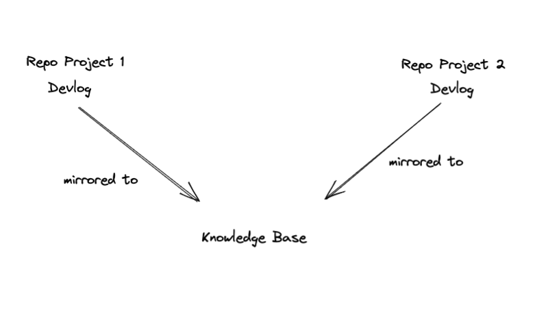

# devlogs


Project based session logging for solo-developers with the option to mirror changes to another directory.

https://stacktrace.one/blog/avoid-project-management-solo-dev/



## Installation

Add this line to your application's Gemfile:

```ruby
gem 'devlogs'
```

And then execute:

    $ bundle install

Or install it yourself as:

    $ gem install devlogs

## Usage
### Initialize
Inside your project initialize the `__devlogs` repository:
```bash
$ devlogs init
```

Follow the prompts to setup the project configuration located in `__devlogs/.devlogs.config`. 

You can setup a mirror directory path in the configuration stage to sync changes to another directory on your machine, for example to Obsidian.md.

Example:

```
myproject
 __devlogs
   >> content
```

```
obsidianvault
  project
    mirror_logs
     >> content mirrored here
```

### Creating entries
Once you are done for the day or session run the `entry` command:

```bash
devlogs entry
```

Your editor will pop up and you can fill in cliff notes.

```
# <DATE HERE>

* Setup Postgresql Database
* Created the Post and User models
* Can't figure out how to connect devise + omniauth yet - need to figure that out
```

Save and if you set a mirror it will sync over!

## Development

After checking out the repo, run `bin/setup` to install dependencies. You can also run `bin/console` for an interactive prompt that will allow you to experiment.

To install this gem onto your local machine, run `bundle exec rake install`. To release a new version, update the version number in `version.rb`, and then run `bundle exec rake release`, which will create a git tag for the version, push git commits and the created tag, and push the `.gem` file to [rubygems.org](https://rubygems.org).

## Contributing

Bug reports and pull requests are welcome on GitHub at https://github.com/[USERNAME]/devlogs.

## License

The gem is available as open source under the terms of the [MIT License](https://opensource.org/licenses/MIT).
